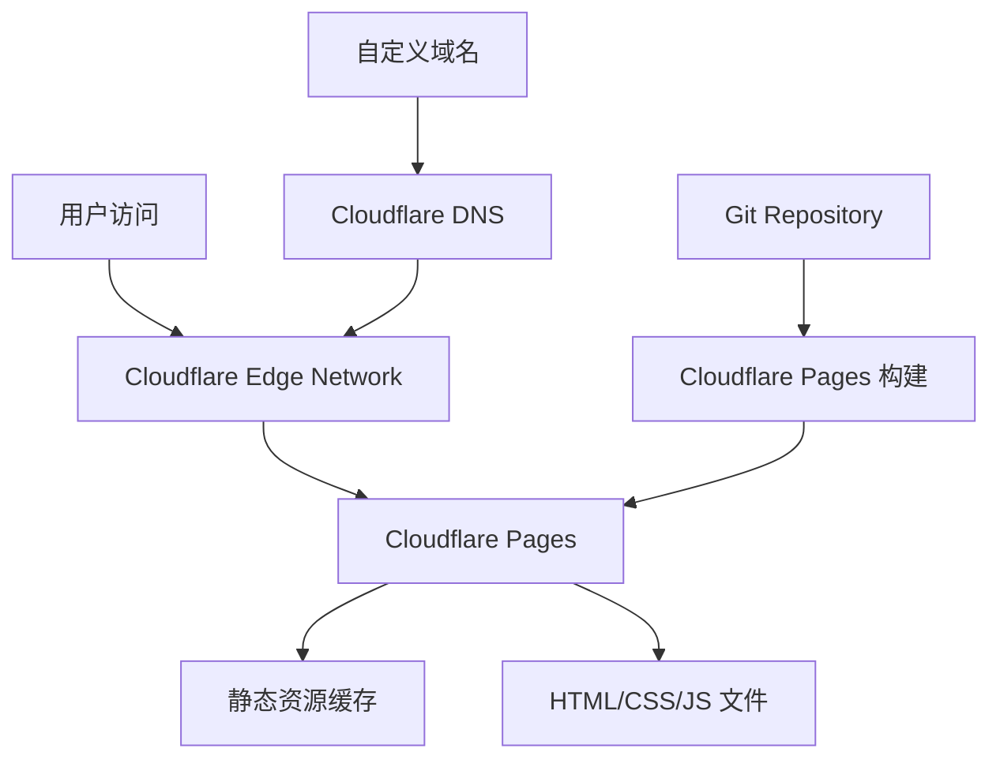

# 循鑫再生资源网站 Cloudflare Pages 部署设计文档

## 概述

本设计文档详细描述了循鑫再生资源企业落地页在 Cloudflare Pages 平台的部署架构、配置策略和优化方案。项目采用静态网站架构，利用 Cloudflare 的全球 CDN 网络实现高性能访问。

## 架构设计

### 整体架构



### 技术栈架构

- **前端框架**: 纯静态 HTML5 + CSS3 + JavaScript ES6+
- **UI 框架**: Bootstrap 5.3
- **图标库**: Font Awesome 6.4
- **动画库**: AOS 2.3
- **部署平台**: Cloudflare Pages
- **CDN**: Cloudflare Global Network
- **DNS**: Cloudflare DNS

## 组件和接口设计

### 1. 项目结构优化

```
项目根目录/
├── index.html                 # 主页面 (入口文件)
├── _headers                   # Cloudflare 安全头配置
├── _redirects                 # URL 重定向规则
├── robots.txt                 # 搜索引擎爬虫配置
├── sitemap.xml               # 网站地图
├── assets/
│   ├── css/
│   │   └── main.css          # 主样式文件
│   ├── js/
│   │   └── main.js           # 主脚本文件
│   ├── images/               # 图片资源
│   └── fonts/                # 字体文件
└── .gitignore                # Git 忽略文件
```

### 2. Cloudflare Pages 配置接口

#### 构建配置
```yaml
Build Configuration:
  Build command: ""           # 静态网站无需构建命令
  Build output directory: "." # 根目录作为输出目录
  Root directory: "/"         # 项目根目录
```

#### 环境变量
```yaml
Environment Variables:
  NODE_ENV: "production"
  CLOUDFLARE_PAGES: "true"
```

### 3. 安全头配置 (_headers)

```
/*
  X-Frame-Options: DENY
  X-Content-Type-Options: nosniff
  X-XSS-Protection: 1; mode=block
  Referrer-Policy: strict-origin-when-cross-origin
  Content-Security-Policy: default-src 'self'; script-src 'self' 'unsafe-inline' https://cdn.jsdelivr.net https://cdnjs.cloudflare.com; style-src 'self' 'unsafe-inline' https://cdn.jsdelivr.net https://cdnjs.cloudflare.com; img-src 'self' data: https:; font-src 'self' https://cdnjs.cloudflare.com; connect-src 'self'
  Strict-Transport-Security: max-age=31536000; includeSubDomains; preload
  Permissions-Policy: camera=(), microphone=(), geolocation=()

/*.css
  Cache-Control: public, max-age=31536000, immutable

/*.js
  Cache-Control: public, max-age=31536000, immutable

/*.png
  Cache-Control: public, max-age=31536000, immutable

/*.jpg
  Cache-Control: public, max-age=31536000, immutable

/*.webp
  Cache-Control: public, max-age=31536000, immutable

/*.svg
  Cache-Control: public, max-age=31536000, immutable
```

### 4. 重定向配置 (_redirects)

```
# 强制 HTTPS
http://xunxin-resources.com/* https://xunxin-resources.com/:splat 301!

# 处理 SPA 路由 (如果需要)
/*    /index.html   200

# 旧 URL 重定向 (如果有)
/old-page    /    301
```

## 数据模型

### 1. 网站元数据模型

```javascript
const siteMetadata = {
  title: "循鑫再生资源有限公司 - 专业废旧金属回收_二手电器回收_珠宝回收_全国服务",
  description: "循鑫再生资源专业提供全国废旧金属、二手电器、珠宝首饰、废旧机械回收及钢结构拆除服务，价格公道，上门回收，即时结算。",
  keywords: "废品回收,金属回收,电器回收,珠宝回收,钢结构拆除,再生资源,全国服务",
  author: "循鑫再生资源有限公司",
  url: "https://your-domain.pages.dev",
  image: "/assets/images/logo/横向logo.svg",
  locale: "zh_CN"
};
```

### 2. 结构化数据模型

```javascript
const structuredData = {
  "@context": "https://schema.org",
  "@type": "LocalBusiness",
  "name": "循鑫再生资源有限公司",
  "description": "专注于资源再生与循环利用的综合型企业",
  "url": "https://your-domain.pages.dev",
  "telephone": "13114908387",
  "email": "xunxin2025@126.com",
  "address": {
    "@type": "PostalAddress",
    "streetAddress": "全国服务，总部位于天津",
    "addressLocality": "全国",
    "addressCountry": "CN"
  },
  "openingHours": "Mo-Su 08:00-18:00",
  "priceRange": "$"
};
```

## 错误处理

### 1. HTTP 错误页面

创建自定义错误页面：
- `404.html` - 页面未找到
- `500.html` - 服务器错误

### 2. 资源加载错误处理

```javascript
// 图片加载失败处理
document.querySelectorAll('img').forEach(img => {
  img.onerror = function() {
    this.style.opacity = '0';
    this.alt = '图片加载失败';
  };
});

// CDN 资源加载失败回退
function loadFallbackCSS() {
  if (!window.Bootstrap) {
    const fallbackCSS = document.createElement('link');
    fallbackCSS.rel = 'stylesheet';
    fallbackCSS.href = '/assets/css/bootstrap-fallback.css';
    document.head.appendChild(fallbackCSS);
  }
}
```

### 3. 网络连接错误处理

```javascript
// 检测网络状态
window.addEventListener('online', () => {
  console.log('网络连接已恢复');
});

window.addEventListener('offline', () => {
  console.log('网络连接已断开');
  // 显示离线提示
});
```

## 测试策略

### 1. 部署前测试

#### 本地测试环境
```bash
# 使用 Python 启动本地服务器
python -m http.server 8000

# 或使用 Node.js serve
npx serve .
```

#### 测试检查清单
- [ ] 所有页面链接正常工作
- [ ] 图片资源正确加载
- [ ] CSS 样式正确应用
- [ ] JavaScript 功能正常
- [ ] 响应式设计在不同设备上正常显示
- [ ] 表单验证功能正常
- [ ] 外部 CDN 资源可访问

### 2. 部署后测试

#### 功能测试
- [ ] 网站可通过 HTTPS 访问
- [ ] 所有页面加载速度 < 3 秒
- [ ] 移动端适配正常
- [ ] SEO 元标签正确
- [ ] 安全头配置生效

#### 性能测试工具
- Google PageSpeed Insights
- GTmetrix
- WebPageTest
- Lighthouse

### 3. 自动化测试

#### GitHub Actions 工作流
```yaml
name: Deploy to Cloudflare Pages
on:
  push:
    branches: [main]
  pull_request:
    branches: [main]

jobs:
  test:
    runs-on: ubuntu-latest
    steps:
      - uses: actions/checkout@v3
      - name: Validate HTML
        run: |
          # HTML 验证
          npx html-validate index.html
      - name: Test Links
        run: |
          # 链接检查
          npx broken-link-checker http://localhost:8000
```

## 性能优化策略

### 1. 资源优化

#### 图片优化
- 使用 WebP 格式
- 实现懒加载
- 响应式图片
- 图片压缩

#### CSS/JS 优化
- 代码压缩
- 移除未使用的 CSS
- 关键 CSS 内联
- JavaScript 延迟加载

### 2. 缓存策略

#### Cloudflare 缓存配置
```javascript
// 页面规则配置
const cacheRules = {
  "*.css": "1 year",
  "*.js": "1 year", 
  "*.png|*.jpg|*.webp": "1 year",
  "*.html": "4 hours"
};
```

### 3. CDN 优化

- 启用 Brotli 压缩
- 使用 HTTP/2
- 启用 Early Hints
- 配置 Service Worker (可选)

## 安全考虑

### 1. 内容安全策略 (CSP)

严格的 CSP 配置防止 XSS 攻击：
```
Content-Security-Policy: 
  default-src 'self'; 
  script-src 'self' 'unsafe-inline' https://cdn.jsdelivr.net https://cdnjs.cloudflare.com; 
  style-src 'self' 'unsafe-inline' https://cdn.jsdelivr.net https://cdnjs.cloudflare.com; 
  img-src 'self' data: https:; 
  font-src 'self' https://cdnjs.cloudflare.com;
```

### 2. HTTPS 强制

- 自动 HTTPS 重定向
- HSTS 头配置
- 安全 Cookie 设置

### 3. DDoS 防护

利用 Cloudflare 的内置 DDoS 防护：
- 自动威胁检测
- 速率限制
- IP 信誉过滤

## 监控和维护

### 1. 性能监控

- Cloudflare Analytics
- Google Analytics
- 实时用户监控 (RUM)

### 2. 错误监控

- JavaScript 错误追踪
- 404 错误监控
- 性能指标监控

### 3. 定期维护

- 依赖库更新
- 安全补丁应用
- 性能优化审查
- 内容更新