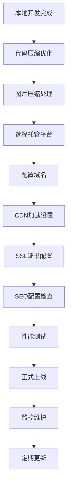
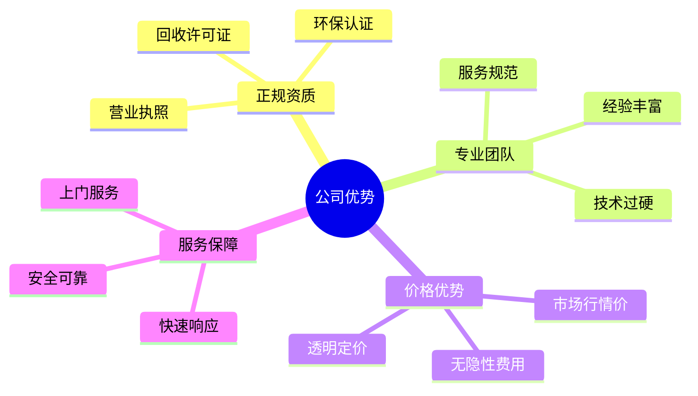
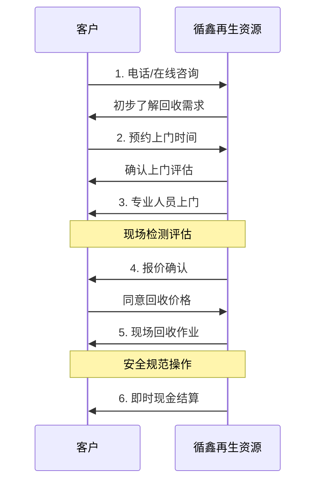
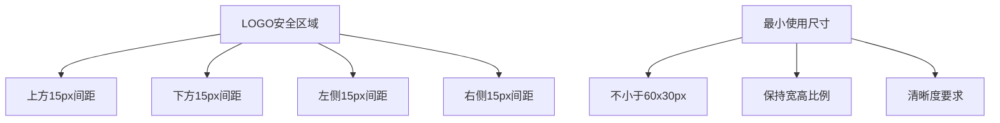

# 循鑫（天津）再生资源有限公司企业落地页设计

## 概述

### 项目目标
为循鑫（天津）再生资源有限公司打造一个专业的企业落地页，全面展示公司的再生资源回收业务，体现"专业、真诚、靠谱"的服务理念，提升企业形象，增强客户信任度，并促进业务咨询转化。

### 企业定位
循鑫（天津）再生资源有限公司是一家专注于资源再生与循环利用的综合型企业，致力于推动绿色环保产业发展，为客户提供高效、安全、规范的再生资源回收与利用解决方案。

### 核心价值主张
- **专业服务**：丰富的行业经验和专业团队，确保服务质量
- **真诚合作**：注重与客户建立长期、互信的合作关系
- **靠谱承诺**：完善的服务体系，高效、安全、规范的作业流程
- **双赢理念**：实现经济效益与社会效益的双赢
- **绿色环保**：推动循环经济发展，减少资源浪费和环境污染

### 目标用户群体
- **个人用户**：有废旧物品回收需求的居民
- **企业客户**：需要处理废旧设备、钢结构拆除的企业
- **合作伙伴**：寻求再生资源供应的下游企业

## 视觉设计与配图方案

### 整体视觉风格
- **色调风格**：以绿色、蓝色为主调，体现环保和专业
- **设计理念**：现代简约，突出工业质感与环保理念结合
- **图片风格**：真实工业场景，避免过度修饰，体现专业可靠

### Pixabay配图搜索指南

#### 英雄横幅背景图
**搜索关键词**：
- "recycling center industrial"
- "metal scrap yard aerial"
- "green technology recycling"
- "industrial environment sustainable"

**选择标准**：
- 宽屏比例（16:9或更宽）
- 高分辨率（至少1920px宽）
- 工业场景但不显杂乱
- 可以添加文字覆盖的区域

#### 各业务板块配图

##### 1. 生产性废旧金属回收
**搜索关键词**：
- "scrap metal pile industrial"
- "copper aluminum recycling"
- "steel scrap yard"
- "metal recycling sorting"

**图片特点**：整齐堆放的金属材料，体现规模和专业性

##### 2. 二手旧电器回收
**搜索关键词**：
- "old appliances recycling"
- "electronic waste collection"
- "refrigerator washing machine recycle"
- "e-waste management"

**图片特点**：各类家电整齐摆放，体现分类回收的专业性

##### 3. 珠宝首饰回收
**搜索关键词**：
- "gold jewelry recycling"
- "precious metals recovery"
- "jewelry evaluation scale"
- "gold silver platinum"

**图片特点**：高端大气，体现贵重物品的专业处理

##### 4. 废旧机械回收
**搜索关键词**：
- "industrial machinery scrap"
- "heavy equipment recycling"
- "factory equipment disposal"
- "mechanical parts recycling"

**图片特点**：大型机械设备，体现处理能力和技术实力

##### 5. 再生资源回收
**搜索关键词**：
- "recycling sorting facility"
- "waste segregation plant"
- "material recovery center"
- "recycling conveyor belt"

**图片特点**：现代化分拣设施，体现环保科技

##### 6. 钢结构拆除
**搜索关键词**：
- "steel structure demolition"
- "industrial building dismantling"
- "crane demolition work"
- "construction site recycling"

**图片特点**：专业拆除作业现场，体现安全规范操作

#### 公司优势板块配图

##### 正规资质
**搜索关键词**：
- "business certificate official"
- "industrial license document"
- "quality certification badge"

##### 专业团队
**搜索关键词**：
- "industrial workers team"
- "recycling facility workers"
- "professional staff uniform"

##### 服务保障
**搜索关键词**：
- "delivery truck recycling"
- "mobile recycling service"
- "on-site collection service"

#### 服务流程配图
**搜索关键词**：
- "phone consultation business"
- "site inspection evaluation"
- "handshake business deal"
- "cash payment transaction"
- "truck loading materials"

#### 联系我们板块
**搜索关键词**：
- "modern office building"
- "industrial facility exterior"
- "business contact center"
- "tianjin city skyline"

### 图片规格要求

| 用途 | 推荐尺寸 | 格式要求 | 质量要求 |
|------|----------|----------|-----------|
| 英雄横幅 | 1920x1080px | JPG/WebP | 高质量，<500KB |
| 业务卡片 | 400x300px | JPG/WebP | 中等质量，<200KB |
| 图标配图 | 64x64px | PNG/SVG | 矢量优先 |
| 背景图案 | 1200x800px | JPG/WebP | 适中质量，<300KB |

### 图片优化建议

#### 移动端适配
- 每张图片准备2-3个尺寸版本
- 使用响应式图片技术（srcset）
- WebP格式优先，JPG作为后备

#### 性能优化
- 启用图片懒加载
- 关键图片（英雄横幅）优先加载
- 使用适当的压缩比例

#### 品牌一致性
- 所有图片色调保持一致
- 避免过于鲜艳的色彩冲突
- 保持工业风格的统一性

### 图片替代文本(Alt Text)建议

```
英雄横幅："循鑫再生资源现代化回收处理设施"
金属回收："专业金属废料分类回收现场"
电器回收："二手家电环保回收服务"
珠宝回收："贵金属珠宝专业检测回收"
机械回收："大型工业设备回收处理"
钢结构："安全规范的钢结构拆除作业"
```


## 技术实现与部署策略

### 静态网站生成方案

#### 推荐技术栈
| 技术分类 | 选择方案 | 使用原因 | 具体版本 |
|---------|----------|----------|----------|
| 前端框架 | 原生HTML/CSS/JavaScript | 轻量级，快速部署，SEO友好 | HTML5, CSS3, ES6+ |
| CSS框架 | Bootstrap 5 | 响应式设计，组件丰富，成熟稳定 | Bootstrap 5.3+ |
| 图标库 | Font Awesome | 图标资源丰富，加载快速 | Font Awesome 6.0+ |
| 动画库 | AOS (Animate On Scroll) | 滚动动画效果，提升用户体验 | AOS 2.3+ |
| 地图服务 | 高德地图API | 本土化服务，定位准确 | 高德地图JS API 2.0 |
| 构建工具 | Webpack/Vite | 代码打包优化，开发便利 | Vite 4.0+ |
| 部署方案 | 静态文件托管 | 成本低，维护简单 | CDN + OSS |

#### 项目文件结构

```
xunxin-website/
├── index.html              # 主页面文件
├── assets/
│   ├── css/
│   │   ├── main.css        # 主样式文件
│   │   ├── responsive.css  # 响应式样式
│   │   └── components.css  # 组件样式
│   ├── js/
│   │   ├── main.js         # 主要JavaScript
│   │   ├── components.js   # 组件交互
│   │   └── utils.js        # 工具函数
│   ├── images/
│   │   ├── logo/           # LOGO文件目录
│   │   ├── hero/           # 英雄横幅图片
│   │   ├── business/       # 业务板块配图
│   │   └── icons/          # 图标文件
│   └── fonts/              # 字体文件
├── config/
│   └── build.config.js     # 构建配置
└── README.md               # 项目说明
```

### 部署方案

#### 静态文件托管选择

| 托管平台 | 优势 | 适用场景 | 成本 |
|---------|------|----------|------|
| 阿里云OSS | 国内访问快，CDN支持 | 企业级应用 | 低成本 |
| 腾讯云COS | 稳定可靠，集成度高 | 商业网站 | 低成本 |
| GitHub Pages | 免费，适合展示 | 展示型网站 | 免费 |
| Netlify | 自动部署，功能丰富 | 开发测试 | 免费/付费 |
| Vercel | 性能优秀，全球CDN | 现代化部署 | 免费/付费 |

#### 推荐部署流程



### 性能优化策略

#### 代码层面优化
- **CSS优化**：关键CSS内联，非关键CSS延迟加载
- **JavaScript优化**：代码分割，按需加载
- **图片优化**：WebP格式，响应式图片，懒加载
- **字体优化**：字体子集化，预加载关键字体

#### 网络层面优化
- **CDN配置**：全球内容分发网络
- **压缩传输**：Gzip/Brotli压缩
- **缓存策略**：浏览器缓存，服务器缓存
- **HTTP/2**：多路复用，服务器推送

## 组件架构

### 页面结构设计

```mermaid
graph TD
    A[落地页根容器] --> B[导航栏组件]
    A --> C[英雄横幅组件]
    A --> D[业务范围组件]
    A --> E[公司优势组件]
    A --> F[服务流程组件]
    A --> G[联系我们组件]
    A --> H[页脚组件]
    
    B --> B1[LOGO展示]
    B --> B2[导航菜单]
    B --> B3[联系电话]
    
    C --> C1[主标题]
    C --> C2[副标题]
    C --> C3[CTA按钮]
    C --> C4[背景视觉]
    
    D --> D1[金属回收卡片]
    D --> D2[电器回收卡片]
    D --> D3[珠宝回收卡片]
    D --> D4[机械回收卡片]
    D --> D5[钢结构拆除卡片]
    
    E --> E1[资质证书]
    E --> E2[服务承诺]
    E --> E3[价格优势]
    E --> E4[响应速度]
    
    F --> F1[联系咨询]
    F --> F2[上门评估]
    F --> F3[价格确认]
    F --> F4[现场回收]
    F --> F5[即时结算]
    
    G --> G1[联系表单]
    G --> G2[地址信息]
    G --> G3[地图展示]
    G --> G4[工作时间]
```



### 组件定义

#### 1. 导航栏组件 (NavigationBar)
**功能说明**：提供页面导航和品牌展示
- **品牌标识区域**：
  - LOGO位置：导航栏左侧，预留120x60px区域
  - LOGO格式要求：PNG/SVG，背景透明
  - 公司名称："循鑫（天津）再生资源有限公司"位于LOGO右侧
  - 响应式调整：移动端LOGO缩小至80x40px
- **导航菜单**：平滑滚动到页面各部分
- **联系信息**：突出显示联系电话
- **响应式行为**：移动端折叠为汉堡菜单

**LOGO设计规范**：
- 标准尺寸：120x60px（桌面端）
- 最小尺寸：80x40px（移动端）
- 安全区域：LOGO周围保持15px间距
- 文件格式：SVG优先，PNG后备（2倍分辨率）
- 背景要求：透明背景，适配浅色导航栏

#### 2. 英雄横幅组件 (HeroBanner)
**功能说明**：首屏核心信息展示和转化引导
- **品牌展示区域**：
  - 大版LOGO：预留200x100px位置，居中显示
  - 可选白色版本：适配深色背景使用
- **主标题**："专业·真诚·靠谱 - 循鑫再生资源"
- **副标题**："专注资源再生与循环利用，为天津及周边地区提供专业回收服务"
- **服务理念展示**：突出"专业、真诚、靠谱"的核心理念
- **行动召唤**：明显的"立即咨询"按钮
- **视觉背景**：环保主题的背景图像，体现绿色循环理念

**英雄区LOGO规范**：
- 展示尺寸：200x100px
- 位置：主标题上方居中
- 颜色版本：提供白色版本适配深色背景
- 动画效果：可添加淡入动画

#### 3. 业务范围组件 (BusinessScope)
**功能说明**：详细展示各类回收业务

| 业务类型 | 主要内容 | 目标客户 | 服务特色 |
|---------|----------|----------|----------|
| 生产性废旧金属回收 | 铜、铝、不锈钢、铁等金属材料 | 生产企业、制造工厂 | 统一回收和处理，高效再利用 |
| 二手旧电器回收 | 废旧电器、办公设备、家用电器 | 企业、家庭用户 | 环保拆解，减少电子废弃物污染 |
| 珠宝首饰回收 | 黄金、白银、铂金、钻石等 | 个人和企业客户 | 交易透明、公平，专业检测 |
| 废旧机械回收 | 工业机械设备、工程机械及零部件 | 工厂企业、工程单位 | 降低企业生产成本，资源再生处理 |
| 再生资源回收 | 纸类、塑料、金属、木材等 | 各类企业和机构 | 分类回收，推动可持续发展 |
| 钢结构拆除与回收 | 厂房、仓库等钢结构建筑 | 建筑开发商、企业 | 专业拆除，安全高效，现场清理 |

#### 4. 公司优势组件 (CompanyAdvantages)
**功能说明**：建立用户信任，突出竞争优势



#### 5. 服务流程组件 (ServiceProcess)
**功能说明**：展示标准化服务流程，降低用户决策成本



#### 6. 联系我们组件 (ContactUs)
**功能说明**：提供多种联系方式，促进转化

- **在线咨询表单**：姓名、电话、回收类型、详情描述
- **联系信息展示**：电话、地址、营业时间
- **地图定位**：公司位置标注
- **即时通讯**：微信二维码展示

## 响应式设计策略

### 断点设置

| 设备类型 | 屏幕宽度 | 布局调整 |
|---------|----------|----------|
| 超小屏(手机竖屏) | < 576px | 单列布局，文字大小调整 |
| 小屏(手机横屏) | 576px - 768px | 卡片2列排列 |
| 中屏(平板) | 768px - 992px | 卡片3列排列 |
| 大屏(桌面) | 992px - 1200px | 完整桌面布局 |
| 超大屏 | > 1200px | 最大宽度限制，居中显示 |

### 移动端优化

#### 触摸友好设计
- **按钮尺寸**：最小44px点击区域
- **间距调整**：增加元素间距，避免误触
- **字体大小**：最小16px，确保可读性

#### 性能优化
- **图片压缩**：WebP格式，多分辨率适配
- **懒加载**：图片和非关键内容延迟加载
- **CSS优化**：关键CSS内联，非关键CSS延迟加载

## 用户界面架构

### LOGO设计规范与使用指南

#### LOGO文件规格要求

| 使用场景 | 推荐尺寸 | 文件格式 | 背景要求 | 备注 |
|---------|----------|----------|----------|---------|
| 导航栏标准 | 120x60px | SVG/PNG | 透明 | 主要展示位置 |
| 导航栏移动端 | 80x40px | SVG/PNG | 透明 | 响应式缩放 |
| 英雄横幅 | 200x100px | SVG/PNG | 透明 | 支持白色版本 |
| 页脚展示 | 100x50px | SVG/PNG | 透明 | 次要展示 |
| Favicon | 32x32px | ICO/PNG | 透明 | 浏览器标签 |

#### LOGO颜色版本准备

```
需要准备的LOGO版本：
1. 标准彩色版本 - 用于白色/浅色背景
2. 白色单色版本 - 用于深色背景
3. 黑色单色版本 - 用于特殊场合
4. 灰度版本 - 用于打印或特殊需求
```

#### LOGO安全区域规范



#### LOGO使用位置布局

##### 导航栏LOGO布局
- **位置**：导航栏左上角
- **对齐**：垂直居中对齐
- **间距**：左边距20px，右边距15px
- **响应式**：移动端保持相对位置

##### 英雄横幅LOGO布局
- **位置**：主标题上方，水平居中
- **间距**：距离主标题30px
- **背景适配**：根据背景图自动选择LOGO版本
- **动效**：可添加0.8秒淡入动画

##### 页脚LOGO布局
- **位置**：页脚左侧
- **配合元素**：与联系信息并列显示
- **尺寸**：适中大小，不抢夺主要信息

#### LOGO文件命名规范

```
建议文件命名：
logo-xunxin-standard.svg          (标准彩色版)
logo-xunxin-white.svg             (白色版本)
logo-xunxin-black.svg             (黑色版本)
logo-xunxin-gray.svg              (灰度版本)
logo-xunxin-small.png             (小尺寸PNG)
favicon.ico                       (网站图标)
```

#### LOGO替换实施指南

1. **文件准备**：按照上述规格准备所有版本
2. **路径设置**：放置在 `/assets/images/logo/` 目录
3. **代码替换**：更新HTML中的图片路径引用
4. **测试验证**：
   - 各种屏幕尺寸下的显示效果
   - 不同背景下的LOGO版本切换
   - 加载速度和清晰度检查

#### 品牌一致性检查清单

- [ ] LOGO在所有页面位置保持一致
- [ ] 颜色版本根据背景正确切换
- [ ] 移动端和桌面端比例协调
- [ ] 加载速度符合性能要求
- [ ] 与企业VI手册保持一致

#### 色彩规范
| 颜色用途 | 主色调 | 辅助色 | 使用场景 |
|---------|-------|-------|----------|
| 品牌主色 | 待定（基于提供的品牌色值） | - | LOGO、主要按钮、标题 |
| 环保绿 | #2E7D32 | #4CAF50, #81C784 | 环保元素、成功状态 |
| 专业蓝 | #1976D2 | #2196F3, #64B5F6 | 信任元素、链接 |
| 中性灰 | #424242 | #757575, #BDBDBD | 文本、边框、背景 |
| 警示色 | #F44336 | #FF5722 | 错误提示、紧急联系 |

#### 排版系统
| 文本类型 | 字体大小 | 字体粗细 | 行高 | 使用场景 |
|---------|----------|----------|------|----------|
| 主标题 | 48px/32px(移动端) | 700 | 1.2 | 页面主标题 |
| 副标题 | 36px/24px(移动端) | 600 | 1.3 | 区块标题 |
| 内容标题 | 24px/20px(移动端) | 500 | 1.4 | 卡片标题 |
| 正文 | 16px/14px(移动端) | 400 | 1.6 | 描述文本 |
| 小字 | 14px/12px(移动端) | 400 | 1.5 | 辅助信息 |

### 交互设计

#### 微交互设计
- **悬停效果**：按钮和卡片的微妙阴影变化
- **滚动动画**：元素进入视窗时的淡入效果
- **表单验证**：实时输入验证和友好错误提示
- **加载状态**：表单提交和页面加载的视觉反馈

#### 可访问性设计
- **键盘导航**：支持Tab键导航
- **屏幕阅读器**：语义化HTML和ARIA标签
- **对比度**：文本与背景对比度符合WCAG标准
- **焦点指示**：明确的焦点状态视觉提示

## 内容策略

### SEO优化

#### 页面元数据
```
标题：循鑫（天津）再生资源有限公司 - 专业废旧金属回收_二手电器回收_珠宝回收
描述：循鑫再生资源专业提供天津地区废旧金属、二手电器、珠宝首饰、废旧机械回收及钢结构拆除服务，价格公道，上门回收，即时结算。
关键词：天津废品回收,金属回收,电器回收,珠宝回收,钢结构拆除,再生资源
```

#### 结构化数据
- **本地商业信息**：公司名称、地址、电话、营业时间
- **服务信息**：回收服务类型、覆盖区域
- **评价信息**：客户评价结构化标记

### 内容分层

#### 首要信息层
- 企业定位：专注于资源再生与循环利用的综合型企业
- 服务理念：专业、真诚、靠谱
- 核心使命：推动绿色环保产业发展，提供高效、安全、规范的解决方案
- 服务承诺：建立长期互信合作关系，实现经济效益与社会效益双赢

#### 详细信息层
- 六大主营业务：生产性废旧金属、二手旧电器、珠宝首饰、废旧机械、再生资源、钢结构拆除
- 服务网络：天津及周边地区稳定业务网络
- 专业团队：丰富行业经验和完善服务体系
- 服务流程：规范化作业，透明化交易

#### 支撑信息层
- 企业资质：合规经营，专业认证
- 环保使命：减少资源浪费，降低环境污染
- 社会价值：推动循环经济发展，贡献绿色环保事业
- 合作优势：长期稳定的客户关系，口碑良好

## 测试策略

### 功能测试
| 测试项目 | 测试内容 | 验收标准 |
|---------|----------|----------|
| 响应式布局 | 各断点下布局正常 | 所有元素正确显示，无重叠遮挡 |
| 表单功能 | 联系表单提交 | 验证逻辑正确，提交成功 |
| 导航功能 | 锚点跳转 | 平滑滚动到目标位置 |
| 地图集成 | 地图加载和定位 | 正确显示公司位置 |
| 兼容性 | 主流浏览器测试 | Chrome, Firefox, Safari, Edge |

### 性能测试
- **页面加载速度**：首屏加载时间 < 3秒
- **图片优化**：压缩率 > 70%，格式优化
- **代码压缩**：CSS/JS文件压缩
- **缓存策略**：静态资源缓存配置

### 用户体验测试
- **导航易用性**：用户能快速找到目标信息
- **表单可用性**：填写流程简单直观
- **移动端体验**：触摸操作流畅，内容可读
- **加载体验**：合理的加载提示和渐进式呈现